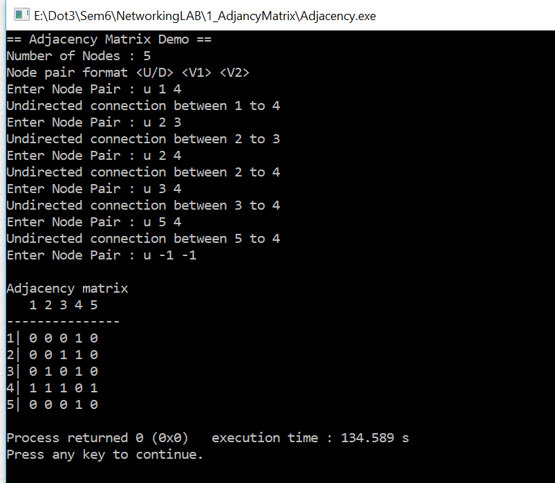

# To represent a network in form of a matrix. 

The procedure for the above stated aim is as follows:
•	Input the number of nodes N in the network (or number of vertices V).
•	Initialize a matrix of size N x N to all zeroes.
•	Assign ‘1’ to the corresponding positions of matrix where an edge is intended in the network. Say if there is an edge between node 3 and 4 in network then a ‘1’ is inserted at position (3, 4) in the matrix.
•	Print the matrix. The matrix represents a graph/network.

